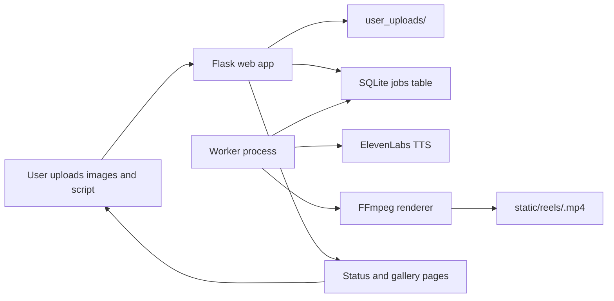

# Architecture

VidSnapAI is currently a small Flask application with a background worker. The web process accepts uploads and creates a job record, while the worker process renders queued jobs into vertical MP4 reels.

## Request Flow

## Components

- `main.py`: Flask routes for home, create, gallery, job status, status API, and error pages.
- `db.py`: SQLite persistence for job state.
- `generate_process.py`: Background worker that polls queued jobs and renders reels.
- `text_to_audio.py`: ElevenLabs text-to-speech integration.
- `templates/`: Jinja views for upload, gallery, status, and errors.
- `Dockerfile` and `docker-compose.yml`: Local deployment packaging for web and worker processes.
- `.github/workflows/ci.yml`: GitHub Actions workflow for automated tests.

## Current Maturity

This is now a Level 2 portfolio project foundation:

- Secrets are loaded from environment variables.
- Uploads are validated before saving.
- Jobs are tracked in SQLite instead of a text file.
- Users can view job status and generated reels.
- The app has Docker packaging and CI tests.
- Generated runtime artifacts are ignored by Git.

## Production Roadmap

- Replace SQLite polling with Redis plus RQ or Celery for retries and concurrency.
- Store uploads and rendered reels in S3-compatible object storage.
- Add authentication and per-user rate limits.
- Add structured logging and metrics for render duration, failures, and queue depth.
- Add WebSocket or server-sent event updates instead of browser polling.
- Add thumbnails and downloadable share pages for completed reels.
